# Laravel Team Manager

> **Author:** Scott Greenhagen

The **Laravel Team Manager** is a web application built on the Laravel PHP framework, intended to manage the organization of related leagues, teams, and players.

---

## Table of Contents

- [Introduction](#introduction)
- [Description](#description)
- [Tech Stack](#tech-stack)
- [Laravel](#laravel)
- [Configuration and Setup](#configuration-and-setup)
- [Using the Team Manager](#using-the-team-manager)
- [Running Pest Test Suites](#running-pest-test-suites)
- [Copyright Information](#copyright-information)

---

## Introduction

This README contains a description of the **Team Manager** application and instructions for setup.
This application runs the bundled Laravel framework on PHP.

---

## Description

**Team Manager** objects consist of the following:

- Leagues
- Teams
- Players

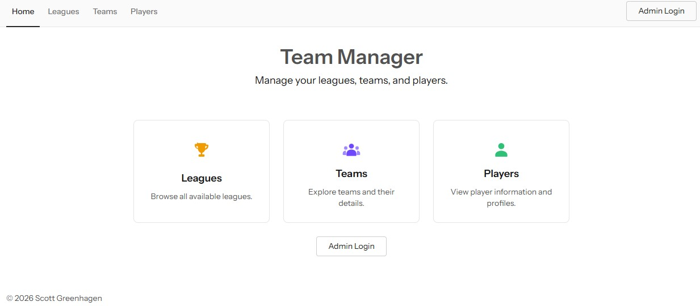

### Public Screens

Public screens are available to view the following:

- A list of leagues, teams, and players
- The details of each individual group

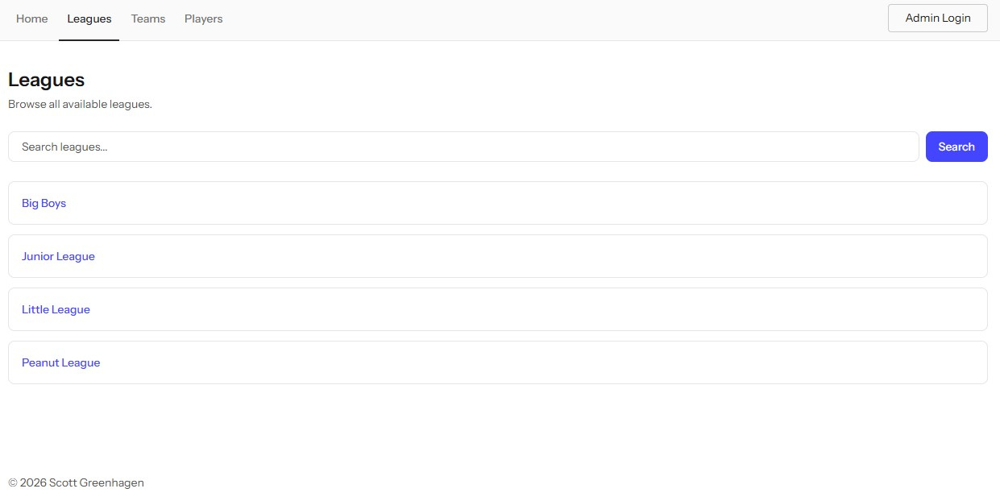
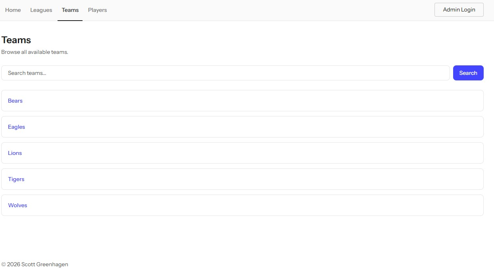
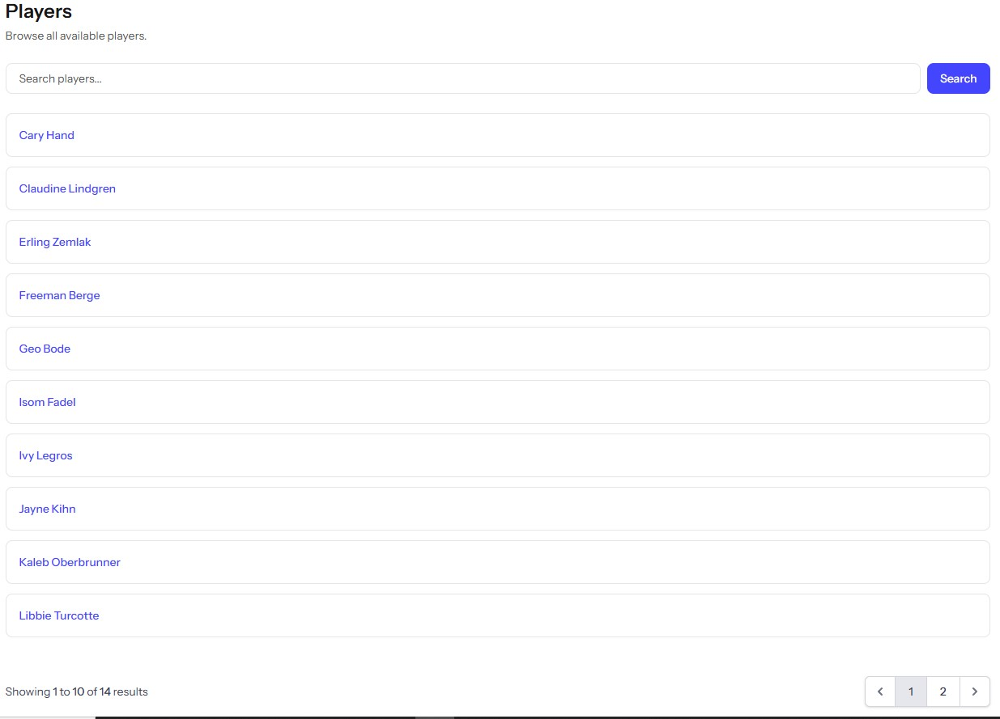

### Administrative Screens

Log in to the administrative dashboard to manage database records.

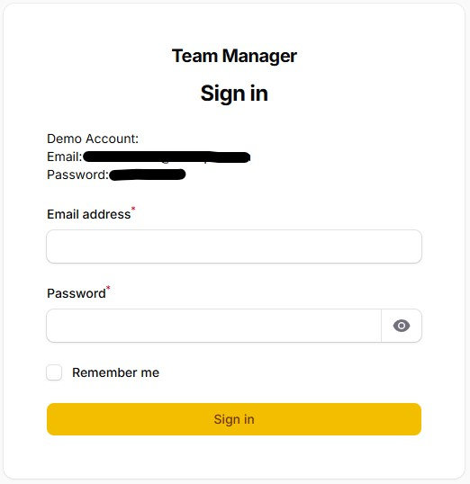

Administrative screens are available for the following:

- View a list of leagues, teams, and players
- Manage individual groups

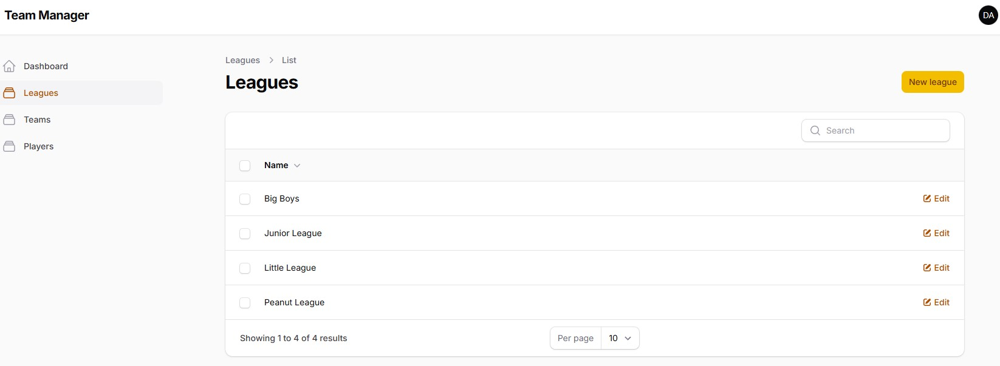
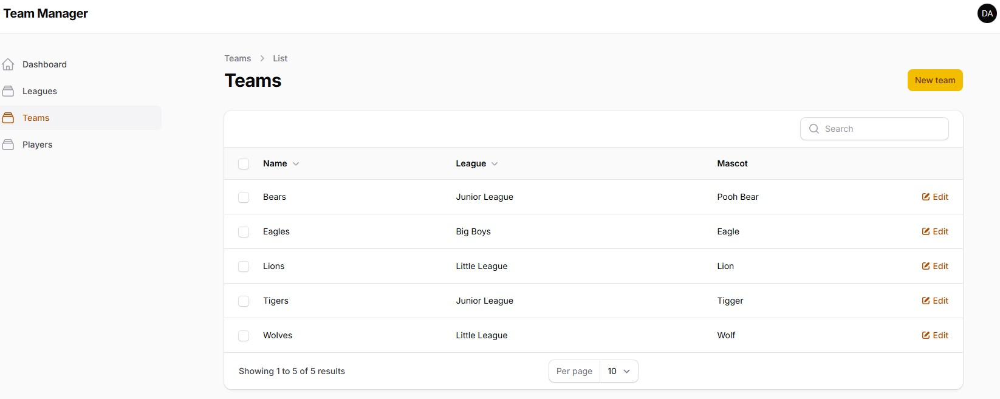
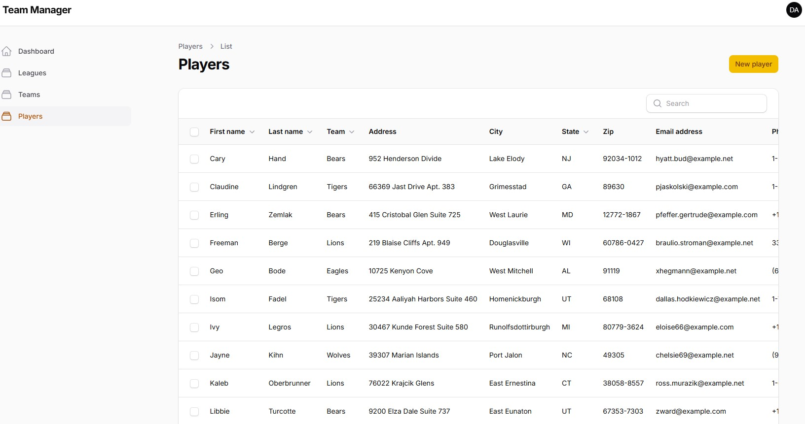

---

## Tech Stack

| Technology | Purpose |
|---|---|
| **PHP** | Foundational server-side scripting language |
| **Laravel** | Backend PHP framework |
| **MySQL** | Database |
| **Livewire** | Frontend framework for dynamic interfaces |
| **Flux UI** | System of UI components for Laravel Blade frontend |
| **Filament** | Server-Driven UI framework for admin panels |
| **TypeScript/JavaScript** | Frontend events |
| **Alpine.js** | Frontend JavaScript framework |
| **Tailwind CSS** | Utility-first CSS framework for frontend |
| **Vite** | Frontend build tool for JavaScript and CSS |
| **HTML5** | Frontend presentation |
| **Docker** | Local development environment |
| **Composer** | Dependency management |
| **Pest** | Automated testing |

---

## Laravel

The Team Manager requires proper installation of the following:

- **PHP 8.4**
- **MySQL 8.0**
- **Laravel MVC Framework 13 (bundled)**

Docker files are available for PHP and MySQL. Laravel is available at no cost from the official website:

[Laravel](https://laravel.com/)

For more information on configuration settings for Laravel, see the Laravel user guide:

[Laravel User Guide](https://laravel.com/framework/docs)

---

## Configuration and Setup

### Development Environment

Docker files are available in the root directory to assist with setting up a runtime environment.
A `.env.example` file is provided for setting environment variables. Copy/rename it to `.env`:

```bash
cd laravel-team-manager
cp .env.example .env
```

Then fill in the blanks in your new .env file. 

**Composer** is used as the dependency manager. From the `laravel-team-manager` directory, 
run composer install to retrieve dependencies:

```bash
composer install
```

From the `laravel-team-manager` directory, run the Docker build step:

```bash
docker compose up --build -d
```

From the `laravel-team-manager` directory, run this command to generate a new APP_KEY for your .env file:

```bash
docker compose exec server php artisan key:generate
```

### Database

The Team Manager utilizes a relational **MySQL** database to store records.
Configure your database connection parameters in the .env file you copied above.

### Database Setup

Automated database migration scripts are provided for easy database setup. 
From the `laravel-team-manager` directory, run Laravel database migrations to 
migrate starter table structures through Docker server:

```bash
docker compose exec server php artisan migrate
```

Seed the database with sample data, using provided database seeder and factories:

```bash
docker compose exec server php artisan db:seed
```

The Team Manager app should then be available at http://localhost:9003/ in your web browser.

---

## Using the Team Manager

From the main index page, you can select from the following screens:

1. **View Leagues**
2. **View Teams**
3. **View Players**

### Navigation

Global navigation is provided at the top of every page. Click the **Home** navigation link at the top left to return to the home page. Click the **Admin Login** button at the top right to access the admin dashboard management area.

### Public Viewing Screens

On the public viewing screens:

- The group listing provides an overview of that group, and a search function to filter records by term.
- Click the name of a group to view its details.
- Leagues and teams detail pages also provide a sub-listing with links to related child records.
- All detail pages provide breadcrumb navigation links back to the associated parent record and listing.

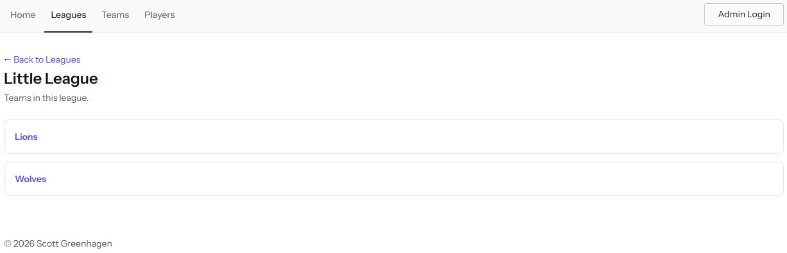
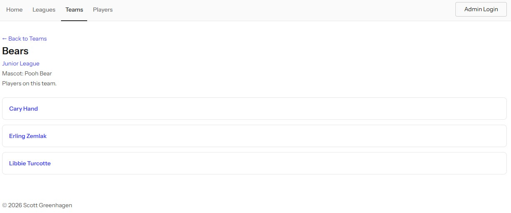
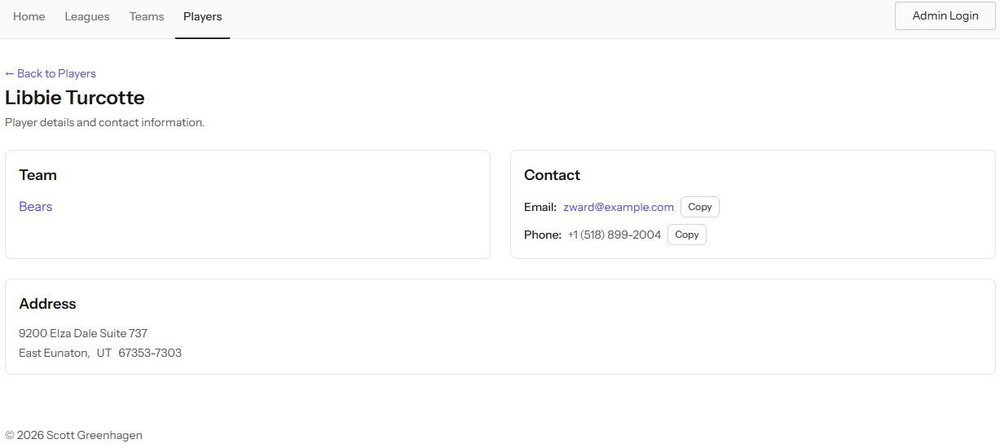

### Administrative Management

Sign in to the administrative dashboard with the following provided demo admin user account credentials...
- Email: demo.admin@example.com
- Password: demoadmin

On the admin screens:

1. **Manage Leagues**
2. **Manage Teams**
3. **Manage Players**

The administrative management pages provide the following options:

1. **Add New Item**
2. **Edit Item**
3. **Delete Item**

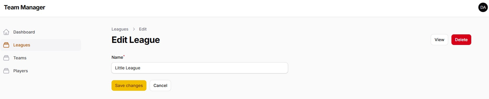
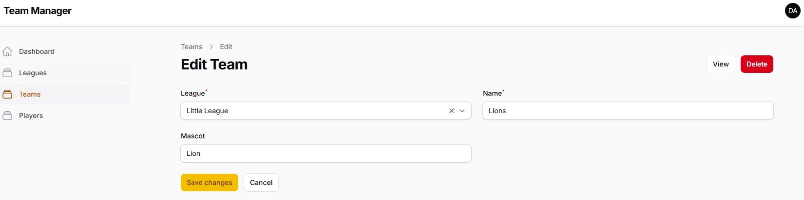
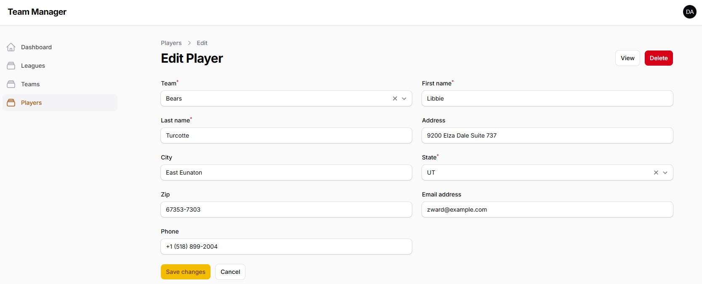

---

## Running Pest Test Suites

The included Pest test suites are located in the `tests` directory.

From the `laravel-team-manager` directory, run all available tests via Laravel Artisan console command:

```bash
docker compose exec server php artisan test
```

Alternatively, run the following Pest tests directly through Docker:

```bash
docker compose exec server ./vendor/bin/pest
```

### Code Coverage

The provided Docker configuration also includes the **PCOV** code coverage client.

To run all tests and display the PCOV coverage report:

```bash
docker compose exec server php artisan test --coverage
```

### Refreshing the Database after Testing

At the conclusion of testing, you may wish to refresh the database and roll back to its original state. 
From the `laravel-team-manager` directory, this command will rerun all database seeds and factories 
to repopulate the migration database tables:

```bash
docker compose exec server php artisan migrate:refresh --seed
```

---

## Copyright Information

Copyright 2026 (built with Laravel 13)  

**Scott Greenhagen**